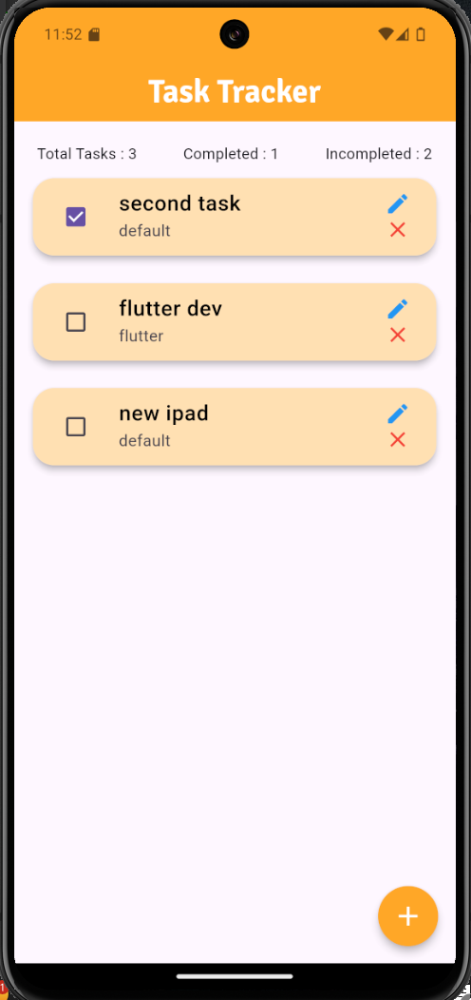

# Task Tracker : To-do app 📓

## 1. Overview 📖
`Task Tracker` is a flutter application that helps users organize their daily tasks and track them through a simple and user-friendly interface.

## 2. Main Features 📱
- **Add Tasks** Users can `Add Tasks` to their list.
- **Edit Tasks** Users can `Edit Tasks` in their list.
- **Delete Tasks** Users can `Delete Tasks` from their list.
- **Add Category** Users can `Add category` to their category list.
- **Track Tasks** Users can `Track Tasks` and know how many tasks they have completed.

## 3. Results ⭐

### 3.1 Home Page 🏠

### 3.2 Add task page ✍️

### Video Result 🎥
[Click to display video results](https://drive.google.com/file/d/1lqfnG1hygPNnk3fd3rXzI-oAGP9j5xeS/view?usp=sharing)

## 4. Conclusion 🏁
`Task Tracker` is the best solution for confused busy people, as it is providing the ability to add tasks and track them easily.

**Author : Yaser Alkhayyat**